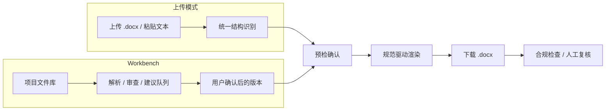
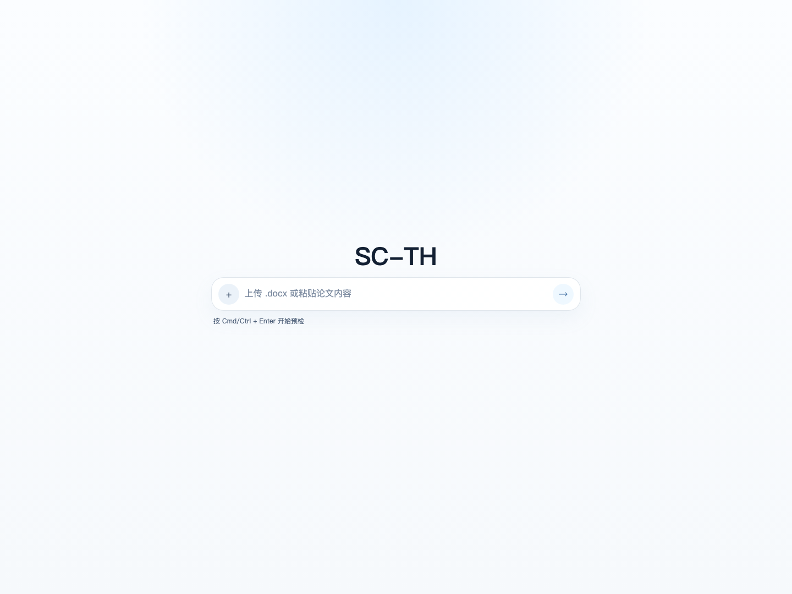

# SC-TH

面向华南师范大学本科毕业论文导出场景的规范驱动 Word 导出工具。

**当前主线：**
1. **快速导出入口** — 上传 `.docx` 或粘贴论文文本，生成按华师规范组织的 Word 文档
2. **Workbench v1 骨架** — 项目空间、文件库、版本、导出记录、Issue Ledger、Proposal 队列和可追溯 Agent 事件

Story2Paper 旧流水线已降级为实验参考，不再作为主工作流入口；任何 AI 候选内容必须进入建议队列，并由用户确认后才可能进入导出版本。

> 本项目不是学校官方系统，但当前导出主线按学校规范实现，不再沿用“只生成正文审查稿”或“不生成学校正式封面”的旧口径。

## 规则仲裁

仓库当前统一按以下优先级实现与验收：

`2025 学校规范 PDF > 学生手册 .doc（仅补充未写明项）> templates/upstream/latex-scnu/main.pdf > 旧模板 / README / 旧逻辑`

对应来源文件：

- `华南师范大学本科毕业论文（设计）撰写基本规范.pdf`
- `华南师范大学本科生毕业论文（设计）手册.doc`
- `templates/upstream/latex-scnu/main.pdf`

## 当前主线



当前导出结果固定生成以下页面角色：

1. 正式封面
2. 中文摘要
3. 英文摘要
4. 目录
5. 正文
6. 参考文献
7. 附录
8. 致谢

固定规则：

- 正式封面已纳入主线第一页。
- 缺失内容保留留白位，不自动补写示例文字。
- 目录使用 Word 可更新字段，不再导出静态目录文本。
- 页码规则固定为：封面不编页码；前置部分大写罗马页码；正文起阿拉伯页码从 `1` 开始。
- 页眉统一使用主标题，单行居中，超长按固定规则截断。
- 表格、图片、脚注、文本框等复杂元素会被标记为“需人工复核”。

## 当前已支持

- `.docx` 上传与纯文本输入共用同一套中间结构解析链路
- 规范驱动的正式封面渲染
- 中文摘要 / 英文摘要 / 目录 / 正文 / 参考文献 / 附录 / 致谢固定生成
- Word TOC 字段、页眉、页脚、页码与分节控制
- 关键段落与 run 级字体显式赋值
- 缺失章节留白策略
- `.docx` 合规检查脚本：`scripts/check_docx_compliance.py`

## 当前边界

- 目标是“本科论文送审稿基线”，不是任意 Word 文档的无损格式修复器
- 表格、图片、脚注、复杂浮动对象不作为阻塞项，但默认进入人工复核范围
- 参考文献只做有限格式整理，不补造作者、刊名、卷期等缺失元数据
- 当前只覆盖本科论文导出主线，不提供研究生模板入口

## 在线预览

- Production: https://scnu-thesis-portal.vercel.app
- 当前模板：`sc-th-word`
- 当前主产物：`.docx`



## 本地运行

```bash
cd /Users/ethan/scnu-thesis-portal
uv sync --extra dev
uv sync --extra story2paper  # Story2Paper 实验依赖（可选）
npm install --prefix web
```

Story2Paper 依赖可选，不进入默认论文导出主线。

启动后端（上传模式）：

```bash
uv run uvicorn backend.app.main:app --reload --port 8000
```

启动 Story2Paper 实验服务（可选，不进入默认主线）：

```bash
# 终端 1：SCNU 渲染 API
uv run uvicorn backend.app.main:app --reload --port 8000
# 终端 2：Story2Paper 流水线 API
uv run uvicorn backend.story2paper.main_s2p:app --reload --port 8001
```

启动前端：

```bash
npm run dev --prefix web
```

本地构建：

```bash
python3 scripts/generate_frontend_types.py
python3 scripts/build_web_public.py
```

## 质量护栏

- `uv run pytest tests -q`
- `npm run test:smoke --prefix web`
- `npm run build --prefix web`
- `python3 scripts/build_web_public.py`
- `python3 scripts/check_docx_compliance.py <docx-path>`

## 关键文档

- [主线说明](docs/product-mainline-word-v1.md)
- [规范映射表](docs/scnu-undergraduate-format-spec-map.md)
- [合规清单](docs/quality-checklist-compliance.md)
- [已知限制](docs/known-limitations-word-export.md)
- [审计报告](docs/compliance/scnu-undergraduate-export-audit-report-v1.md)
- [实施与验收记录](docs/compliance/scnu-undergraduate-export-implementation-record-v1.md)
- [本地运行说明](README-local.md)

## 仓库结构

- `backend/app/`：统一解析、预检、Word 渲染与 API
- `backend/story2paper/`：AI 多 Agent 论文生成流水线（agents / pipeline / exporters / shared）
- `web/`：极简输入页、预检弹窗与导出流程
- `templates/working/sc-th-word/`：当前工作模板与正式封面资产
- `scripts/check_docx_compliance.py`：主线 `.docx` 合规检查脚本
- `docs/`：规范映射、审计、验收与限制说明
