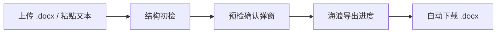

# SC-TH

面向华南师范大学本科论文场景的极简 Word 导出工具：上传 `.docx` 或粘贴文本，先做结构预检，再导出格式化后的 `.docx` 论文文件。

> 当前不是学校官方工具，也不是任意 Word 样式的无损修复器。它优先解决的是“用最短路径拿到一份可交付的本科论文 Word 文档”。

## 在线预览

- Production: https://scnu-thesis-portal.vercel.app
- 当前主模板：`sc-th-word`
- 当前线上主产物：`.docx`


## 当前主路径



产品主线已经切换为：

1. 进入极简首页，只看到 `SC-TH`、一个主输入框、左侧 `+` 上传入口和弱化清空入口。
2. 触发初检后，系统先识别题目、摘要、正文结构、参考文献和封面字段。
3. 弹出“预检确认弹窗”，把阻塞项、警告项、信息项一次性展示出来。
4. 只有阻塞项清零后，才能确认并进入海浪式导出进度。
5. 完成后自动下载 `.docx`，页面回到初始状态。

纯文本输入建议保留显式结构标记，例如：`摘要`、`Abstract`、`# 引言`、`# 参考文献`。结构越明确，预检结果越稳定。


## 当前已支持

- 上传 `.docx` 文件并做结构识别
- 直接粘贴论文文本并做结构识别
- 预检阶段按 `阻塞项 / 警告项 / 信息项` 三层规则返回结果
- 阻塞项按结构块级别标记，未通过时禁止导出
- 通过预检后导出 `.docx` 论文文件
- Word 文档内包含封面、目录、摘要、正文、参考文献、致谢、附录等基础结构
- 目录以 Word 可更新目录字段写入，可在 Word 中手动更新

## 当前明确不支持

- 不支持 `.doc`、`.pdf`、`.txt` 等其他上传格式
- 不再提供网页 review workspace 主路径
- 不再提供 `.tex` 工程 zip 或线上 PDF 作为公开主产物
- 不承诺原 Word 图片、表格、脚注和复杂排版的高保真恢复
- 不承诺正文引用与参考文献条目 100% 自动对齐
- 不提供研究生论文模板入口
- 不提供全文生成能力

## 预检规则

当前默认阻塞项包括：

- 题目缺失或题目明显为占位内容
- 中文摘要缺失或有效长度不足
- 正文主体缺失或正文内容过短
- 未识别到正文结构
- 未识别到参考文献内容
- 模板不可用或导出失败

当前默认警告项包括：

- 英文摘要缺失
- 中文或英文关键词缺失 / 数量异常
- 封面字段缺失
- 章节层级不稳定
- `.docx` 上传模式下复杂 Word 元素可能无法完整迁移

## 本地运行

安装依赖：

```bash
cd /Users/ethan/scnu-thesis-portal
uv sync --extra dev
npm install --prefix web
```

启动后端：

```bash
uv run uvicorn backend.app.main:app --reload --port 8000
```

另开终端启动前端：

```bash
npm run dev --prefix web
```

本地模拟 Vercel：

```bash
python3 scripts/generate_frontend_types.py
python3 scripts/build_web_public.py
PATH="$(dirname "$(uv python find 3.12)"):$PATH" vercel dev
```

更多本地说明见 [README-local.md](README-local.md)。

## 技术架构

- 前端：React + Vite + TypeScript + 原生 CSS tokens
- 后端：FastAPI + Pydantic + python-docx
- 契约：以后端 Pydantic schema 为源，生成前端 TypeScript 类型
- 导出模板：`templates/working/sc-th-word/template.docx`
- 部署：Vercel 单项目 Python FastAPI 入口

## 仓库结构

- `web/`：极简首页、预检弹窗、导出进度与下载流程
- `backend/`：解析、预检规则、Word 导出与 API
- `templates/working/sc-th-word/`：当前线上 `.docx` 导出模板
- `templates/upstream/latex-scnu/`：本科论文版式参考材料
- `docs/`：当前产品说明、部署、质量清单与验收记录
- `docs/archive/legacy-latex-workspace/`：历史 LaTeX / workspace 方案归档
- `tests/`：后端 API 与解析测试

## 质量状态

当前护栏：

- `npm run build --prefix web`
- `npm run test:smoke --prefix web`
- `uv run pytest tests -q`
- `python3 scripts/build_web_public.py`

质量清单见 [quality-checklist-v2.md](docs/quality-checklist-v2.md)。

## 文档

- [产品主线说明](docs/product-mainline-word-v1.md)
- [部署说明](docs/deploy-vercel.md)
- [本地验收清单](docs/local-validation-word.md)
- [质量清单](docs/quality-checklist-v2.md)

## Roadmap

- `v1.0`：极简入口、预检确认弹窗、Word 主导出链
- `v1.1`：增强 `.docx` 标题与封面字段提取
- `v1.2`：增强图片、表格、脚注迁移与参考文献映射
- `v1.3+`：评估更精细的学校格式规则与更多模板配置能力
