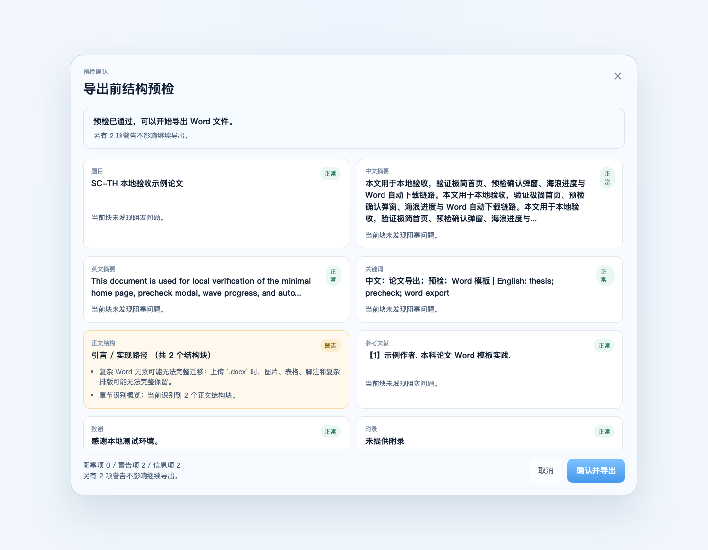
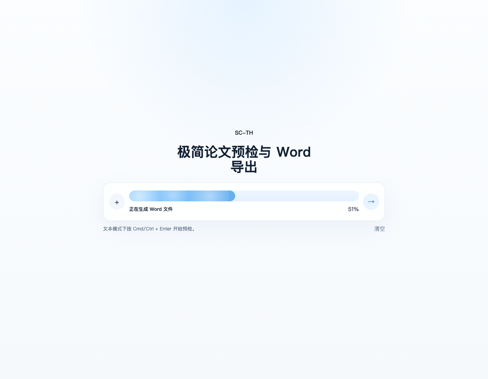

# SC-TH

面向华南师范大学本科论文场景的极简 Word 导出工具：上传 `.docx` 或粘贴文本，先做结构与合规预检，再导出格式化后的 `.docx` 正文审查稿。

> 当前不是学校官方工具，也不是学校统一印制封面的生成器。项目重点保证的是“本科论文正文审查稿”的结构与排版合规；正式统一封面需另行套用学校封面。

## 在线预览

- Production: https://scnu-thesis-portal.vercel.app
- 当前主模板：`sc-th-word`
- 当前线上主产物：`.docx`
- 当前规范基线：
  - [《华南师范大学本科生毕业论文（设计）手册》](docs/sources/华南师范大学本科生毕业论文（设计）手册.doc)
  - [《华南师范大学本科毕业论文（设计）撰写基本规范》](docs/sources/华南师范大学本科毕业论文（设计）撰写基本规范.pdf)


## 当前主路径


当前默认导出顺序按 PDF 规范口径固定为：

1. 不生成学校正式封面
2. 中文摘要
3. 英文摘要（页标题 `Abstract`）
4. 目录
5. 正文与注释
6. 参考文献
7. 附录
8. 致谢

手册与 PDF 规范在“目录是否必备”“参考文献 / 附录顺序”上存在冲突；本轮默认采用 PDF 规范口径，详见 [规范映射表](docs/scnu-undergraduate-format-spec-map.md)。

首页上传入口当前只通过可见 `+` 按钮触发；视觉隐藏的 `input[type="file"]` 已移出 tab 焦点链，文本 / 文件冲突与 busy / exporting 状态都会阻止选文件。





## 合规等级说明

### 已严格支持

- A4 纵向页面设置
- 上 2.5cm / 下 2.5cm / 左 2cm / 右 2cm
- 左侧装订线 0.5cm
- 正文 `BodyText`：小四宋体，1.25 倍行距
- 中文摘要标题 / 正文样式
- 英文摘要页标题 `Abstract`，正文 `Times New Roman`
- 页眉：论文主标题，常见副标题会被剥离，五号宋体，居中
- 页脚：连续阿拉伯页码，五号黑体加粗，居中
- Word 可更新目录字段
- `Heading1`–`Heading4` 多级标题与目录联动
- 首个识别到的标题即使从二级 / 三级起步，也不会再生成 `0.*` 前导零编号
- 英文关键词前缀兼容 `Keyword:`、`Keywords:`、`Key words:`
- 参考文献 / 附录 / 致谢顺序按当前口径输出
- 不再伪造学校正式封面

### 部分支持

- 中文摘要字数：自动提示推荐区间，但仍建议人工复核
- 英文摘要实词数：自动提示超长风险，但不做精确语言学计数
- 参考文献条目：保留结构并输出统一样式，但不自动修正全部 GB3469-83 细节
- 数字编号标题识别：对参考文献、注释区和明显列表项采用保守策略；少量歧义编号短句仍建议人工复核
- 注释：当前提供基础“注释”章节输出，不自动保证页末注 / 篇末注完全合规
- `.docx` 上传中的表格 / 图片 / 脚注：会做风险提示，但不承诺高保真迁移

### 暂不支持

- 学校统一正式封面自动生成
- 图题 / 表题位置与编号的全自动重建
- 原始 `.docx` 复杂浮动对象的无损迁移
- 全文级数字、单位、标点、外文字母规范化
- 引用与参考文献条目 100% 自动对齐
- 研究生模板入口

已知限制详见 [docs/known-limitations-word-export.md](docs/known-limitations-word-export.md)。

## 预检规则

当前阻塞项包括：

- 题目缺失或明显为占位内容
- 中文摘要缺失或明显不足
- 英文摘要缺失
- 正文主体缺失或正文内容过短
- 未识别到参考文献内容
- 模板不可用或导出失败

当前警告项包括：

- 中文摘要不在 250–300 字推荐区间内
- 英文摘要疑似超过 250 个实词
- 中文 / 外文关键词缺失或数量异常
- 中外文关键词未对齐
- 封面字段未补全
- 章节层级不稳定
- 表格 / 图片 / 脚注 / 篇末注等复杂元素需人工复核
- 附录或致谢未识别

## 自动合规检查

生成导出稿后，可直接运行：

```bash
python3 scripts/check_docx_compliance.py /path/to/exported.docx --json
```

当前脚本会自动检查：

- 页面大小、页边距、装订线
- 关键样式是否存在
- 正文 / 摘要样式是否符合预期
- 目录字段是否存在
- 页眉 / 页脚 / 页码字段是否存在
- 中文摘要 / `Abstract` / 目录 / 参考文献 / 附录 / 致谢顺序
- 是否错误生成疑似学校正式封面

脚本结果分为：

- `PASS`：自动确认已满足
- `MANUAL_REVIEW`：需人工复核或发现可疑偏差
- `NOT_SUPPORTED`：当前工具不自动保证

## 当前实测结论

已对以下三份样例完成“解析 -> 预检 -> 导出 -> 合规脚本检查”的自动化全链路，并纳入 `pytest tests/compliance -q`：

- `examples/compliance/sample-text-basic.md`
- `examples/compliance/sample-docx-basic.docx`
- `examples/compliance/sample-docx-complex.docx`

本轮收口已额外确认：

- 上传入口不再暴露不可见键盘焦点，也不会绕过 `SOURCE_CONFLICT`
- 编号参考文献不会再被正文标题识别规则掏空
- 首个二 / 三 / 四级标题起步时不再生成 `0.*` 编号
- 英文摘要关键词兼容 `Keyword:`、`Keywords:`、`Key words:`

本轮结论：**主体已达标，可作为华南师范大学本科论文初稿 / 送审稿的正文排版基线，但图表题注、注释、复杂富文本迁移和参考文献细项仍需人工复核。**

详见：

- [规范映射表](docs/scnu-undergraduate-format-spec-map.md)
- [严格合规质量清单](docs/quality-checklist-compliance.md)
- [审查报告](docs/compliance/scnu-undergraduate-export-audit-report-v1.md)
- [已知限制](docs/known-limitations-word-export.md)

## 本地运行

安装依赖：

```bash
cd /Users/ethan/scnu-thesis-portal
uv sync --extra dev
npm install --prefix web
```

启动后端：

```bash
uv run uvicorn backend.app.main:app --reload --port 8000
```

另开终端启动前端：

```bash
npm run dev --prefix web
```

本地模拟 Vercel：

```bash
python3 scripts/generate_frontend_types.py
python3 scripts/build_web_public.py
PATH="$(dirname "$(uv python find 3.12)"):$PATH" vercel dev
```

更多本地说明见 [README-local.md](README-local.md)。

## 技术架构

- 前端：React + Vite + TypeScript + 原生 CSS tokens
- 后端：FastAPI + Pydantic + python-docx
- 契约：以后端 Pydantic schema 为源，生成前端 TypeScript 类型
- 导出模板：`templates/working/sc-th-word/template.docx`
- 部署：Vercel 单项目 Python FastAPI 入口

## 仓库结构

- `web/`：极简首页、预检弹窗、导出进度与下载流程
- `backend/`：解析、预检规则、Word 导出与 API
- `templates/working/sc-th-word/`：当前 `.docx` 导出模板
- `docs/sources/`：本轮规范审查原件
- `examples/compliance/`：三份合规样例输入
- `tests/`：API、解析与合规检查测试
- `scripts/check_docx_compliance.py`：导出稿自动合规检查脚本
- `.github/workflows/ci.yml`：PR / 分支 CI，运行后端测试、合规样例链路、前端 smoke / build 和 `build_web_public`

历史参考材料已降级归档到 `templates/upstream/latex-scnu/` 与 `docs/archive/legacy-latex-workspace/`，不属于当前产品主线目录。

## 护栏命令

- `npm run build --prefix web`
- `npm run test:smoke --prefix web`
- `uv run pytest tests -q`
- `python3 scripts/build_web_public.py`

GitHub Actions 中的 `CI` workflow 与上述命令保持一致，会在 PR 上给出明确通过 / 失败信号。

## 文档

- [产品主线说明](docs/product-mainline-word-v1.md)
- [本地运行说明](README-local.md)
- [规范映射表](docs/scnu-undergraduate-format-spec-map.md)
- [严格合规质量清单](docs/quality-checklist-compliance.md)
- [审查报告](docs/compliance/scnu-undergraduate-export-audit-report-v1.md)
- [已知限制](docs/known-limitations-word-export.md)
- [部署说明](docs/deploy-vercel.md)
