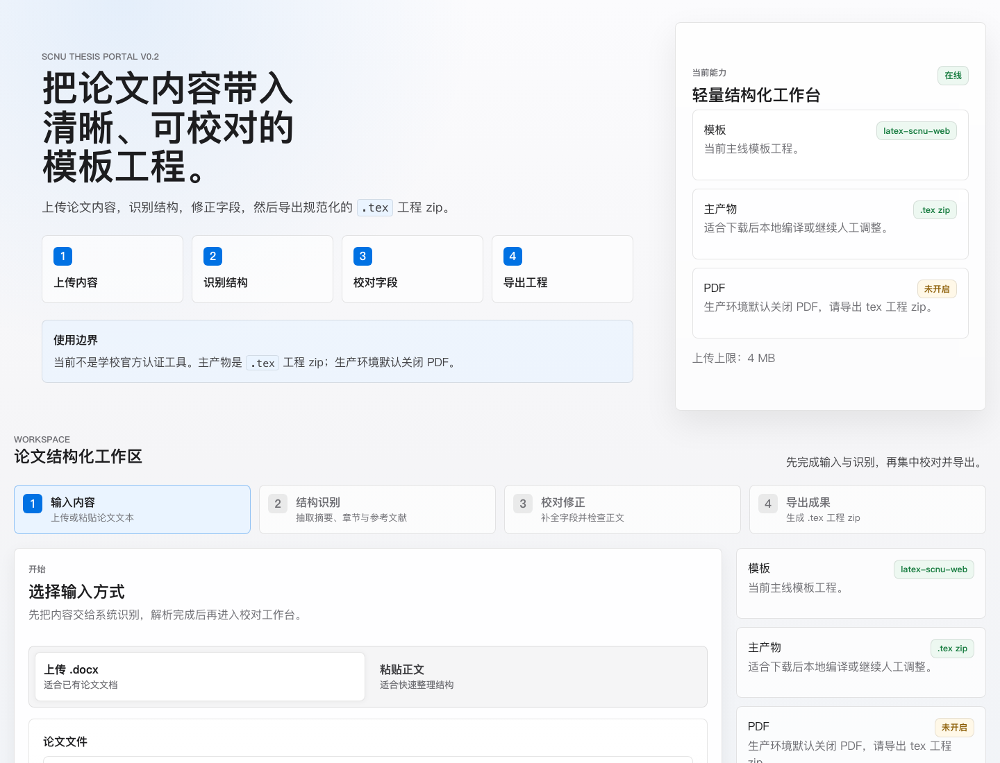
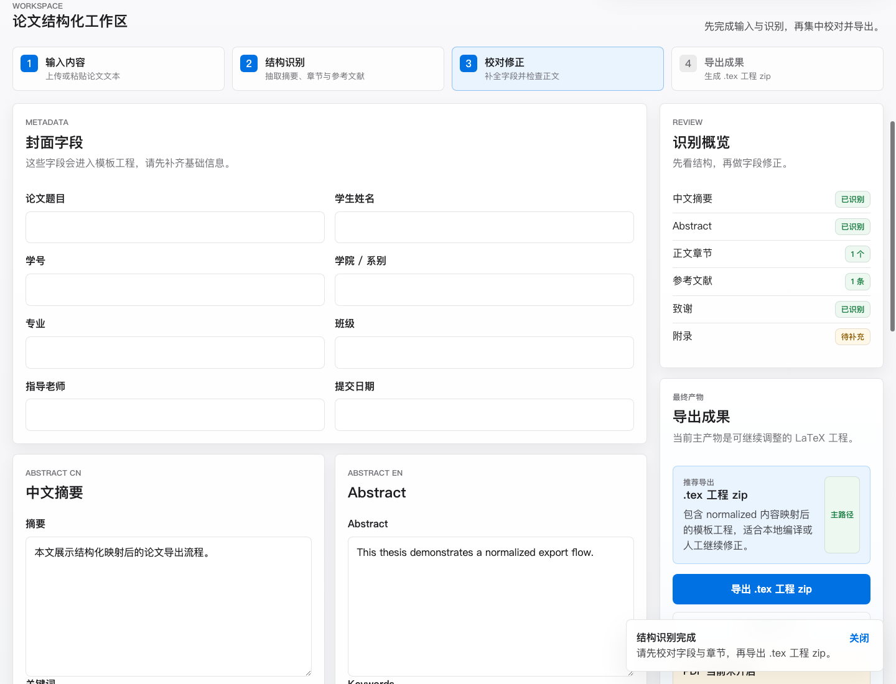
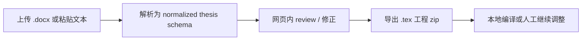

# scnu-thesis-portal

面向华南师范大学论文写作场景的轻量 web-app：把 `.docx` 或粘贴文本解析成可检查、可修正的论文结构，并导出规范化 `.tex` 工程 zip。

> 当前不是学校官方认证工具，也不是万能论文格式修复器。它的目标是先把“内容结构化”和“进入 LaTeX 模板工程”这条主线跑稳。

## 在线预览

- Vercel Preview: https://scnu-thesis-portal-git-feat-vercel-l-e3191b-jia-ethans-projects.vercel.app
- 当前主线模板：`latex-scnu-web`
- 当前线上主产物：`.tex` 工程 zip



## 当前已支持

- 上传 `.docx` 文件并抽取文本与章节结构
- 粘贴论文文本并识别摘要、Abstract、正文、参考文献、致谢、附录
- 在网页内 review / 修正封面字段、摘要、关键词、章节和参考文献
- 导出规范化 `.tex` 工程 zip，便于后续本地编译或人工调整
- 生产环境默认关闭 PDF，并通过 `PDF_DISABLED` 给出明确说明



## 当前前端体验

当前前端采用三段式工作流：

1. 首屏只说明核心路径：上传论文内容、识别结构、校对字段、导出工程。
2. 未解析前只显示输入区，可在 `.docx` 上传和粘贴正文之间切换。
3. 解析完成后进入 review 工作台，集中展示字段修正、正文编辑、识别概览和导出面板。

界面风格以浅色背景、细描边、轻阴影、克制的蓝色强调和短动效为主。玻璃材质只用于首屏状态与轻量反馈，不影响论文编辑区的可读性。

## 当前明确不支持

- 不支持 `.doc`
- 不保留 Word 原始样式
- 不承诺复杂表格、图片、脚注、特殊排版完整恢复
- 不承诺一键自动修复所有论文格式
- 不承诺全文生成
- 不承诺当前输出已经过学校官方规范逐条核验
- 不把线上 PDF 编译作为首轮稳定能力

## 使用流程



1. 打开在线预览或本地开发页面。
2. 选择上传 `.docx`，或切换到“粘贴正文”。
3. 点击“开始识别”，查看系统识别出的摘要、章节、参考文献等结构。
4. 在 review 区补全题目、姓名、学号、学院、导师、日期等封面字段。
5. 点击“导出 `.tex` 工程 zip”。

## 本地运行

安装依赖：

```bash
cd /Users/ethan/scnu-thesis-portal
uv sync --extra dev
npm install --prefix web
```

启动后端：

```bash
uv run uvicorn backend.app.main:app --reload --port 8000
```

另开终端启动前端：

```bash
npm run dev --prefix web
```

本地模拟 Vercel：

```bash
uv run python scripts/generate_frontend_types.py
python3 scripts/build_web_public.py
PATH="$(dirname "$(uv python find 3.12)"):$PATH" vercel dev
```

更多本地说明见 [README-local.md](README-local.md)。

## 技术架构

- 前端：React + Vite + TypeScript
- 后端：FastAPI + Pydantic + python-docx
- 部署：Vercel Preview，单项目 Python FastAPI 入口
- 契约：以后端 Pydantic schema 为源，生成前端 TypeScript 类型
- 模板：`templates/working/latex-scnu-web/` 是当前唯一工作模板
- 上游材料：`templates/upstream/` 仅作为来源与参考，不作为主开发区

线上主路径不依赖后台线程、job polling、`outputs/jobs`、`tmp/jobs` 或长期服务器文件状态。

## 仓库结构

- `web/`：用户界面与 review / export 流程
- `backend/`：解析、标准化、导出与 API
- `templates/working/latex-scnu-web/`：当前工作模板
- `templates/upstream/`：原始上游模板材料
- `docs/`：产品范围、架构、质量清单、部署与审查文档
- `examples/`：示例输入与输出说明
- `tests/`：后端 API、解析与导出测试

## 质量状态

当前最小护栏：

- `uv run pytest tests -q`：16 passed
- `npm run test:smoke --prefix web`：1 passed
- `vercel build`：通过
- 生产依赖 audit：0 vulnerabilities

质量清单见 [docs/quality-checklist-v1.md](docs/quality-checklist-v1.md)。

## Roadmap

- `v0.2`：线上可访问 MVP，支持解析、review / 修正、导出 `.tex` 工程 zip
- `v0.3`：增强 `.docx` 结构识别，尤其是封面元信息、摘要、章节和参考文献边界
- `v0.4`：补端到端测试、错误提示体验和更完整的示例材料
- `v0.5+`：评估是否拆分静态前端与 Python API，或引入更稳定的编译 / 存储方案

## 来源与说明

本项目整理并保留了多套华南师范大学相关 LaTeX 模板作为参考材料。当前仓库没有添加统一许可证，因为上游材料授权仍需继续梳理；在使用模板前，请自行核对学校最新格式要求与上游授权。
