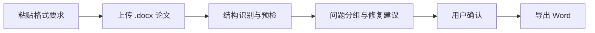

# Forma

Forma 是一个 AI 论文格式优化入口：粘贴格式要求，上传论文文件，让 Agent 完成预检、修复流程编排与 Word 导出。


Forma 不是代写工具，也不是学校官方系统。它的目标是把论文 `.docx` 解析、结构预检、格式风险提示、候选修复与导出放进一个清晰、可追溯的流程里。任何 AI 或规则候选内容都应先进入可审查状态，由用户确认后再生成新版本。

- **公开首页**: 极简入口，面向通用论文格式优化场景
- **Guide**: `/#/guide`，说明支持文件、格式要求粘贴方式、预检范围与隐私边界
- **快速导出**: 上传 `.docx` 或粘贴已有论文正文，预检后导出规范化 Word
- **Workbench Demo**: 示例项目空间，不包含真实论文正文，不调用远程 Provider
- **私有部署**: 推荐用于真实论文、Provider key、本地 Ollama 和完整 Workbench
- **公开边界**: 非官方、非代写、不承诺查重率、不伪造参考文献或实验数据

## Current Product Flow



当前公开首页已经以 **Forma** 为主定位。核心输入只有两项：

1. 学校、学院、期刊或导师发布的论文格式要求。
2. `.docx` 论文文件。

`.docx` 文件校验、公开预检与 Word 导出复用现有 API。格式要求解析、Agent 自动修复策略、差异报告与多规则集选择仍是前端流程预留，后续需要接入真实格式修复 Agent / ruleset API 后再标记为正式能力。

## Features

- `.docx` 上传与纯文本输入共用同一套中间结构解析链路
- `NormalizedThesis v2`: stable block id、source spans、provenance、confidence、comments、format risks
- 预检结果分组: 结构、标题层级、摘要 / 关键词、字体字号、页边距 / 行距、参考文献
- Workbench 项目空间: 项目、文件、版本、导出记录、Issue Ledger、Proposal Queue
- Agent 事件骨架: 解析任务、事件流、规则建议、用户确认 / 拒绝 / 暂存
- 多输入解析 registry: `.docx`、文本、PDF 本地粗解析、图片/OCR 占位、参考文献文件
- 导出 registry: `.docx`、Markdown、自检报告、PDF 降级占位
- Provider 设置: OpenAI、Gemini、DeepSeek、MiniMax、Ollama 元数据、服务端密钥保存、验证状态与 SSRF 防护
- 访问码保护、隐私模式提示、远程 Provider 项目级授权

## Specialized Rule Profiles

仓库中仍保留一个历史专用规则集：华南师范大学本科论文导出 profile。它包含实现记录、规范映射、合规检查脚本与模板资产，用于继续验证 Word 导出的确定性。

这部分不再是公开首页和 GitHub 项目的主定位；它是 Forma 的一个 specialized profile / legacy implementation reference。

相关文件：

- [SCNU 规范映射表](docs/scnu-undergraduate-format-spec-map.md)
- [合规审计记录](docs/compliance/scnu-undergraduate-export-audit-report-v1.md)
- `scripts/check_docx_compliance.py`
- `templates/working/sc-th-word/`

## Quick Start

```bash
git clone https://github.com/Jia-Ethan/forma.git
cd forma

uv sync --extra dev
npm install --prefix web
```

启动后端：

```bash
uv run uvicorn backend.app.main:app --reload --port 8000
```

启动前端：

```bash
VITE_API_BASE_URL=http://127.0.0.1:8000 npm run dev --prefix web
```

访问：

- Forma: `http://127.0.0.1:5173/`
- Guide: `http://127.0.0.1:5173/#/guide`
- Workbench: `http://127.0.0.1:5173/#/workbench`
- Workbench Demo: `http://127.0.0.1:5173/#/workbench-demo`

## Self-host

真实论文建议使用私有部署。复制 `.env.example` 后设置：

- `SCNU_ACCESS_CODE`: 历史命名，当前仍用于保护 API 和 Workbench
- `SCNU_SECRET_KEY`: 历史命名，当前仍用于服务端封存 Provider API key
- Ollama 本地模型: 优先用于隐私敏感的草稿候选

```bash
docker compose up --build
```

生产主站建议使用可控服务器、自定义域名与长期存储。完整 Workbench、Provider key、远程授权和长期项目数据建议放在私有环境。

生产部署参考：

```bash
cp .env.production.example .env.production
docker compose --env-file .env.production -f docker-compose.production.yml up -d --build
```

运维说明见 [部署 Runbook](docs/ops-mainland-runbook.md)。

## Privacy

- 公开站默认不启用远程 LLM Provider
- 公开导出文件保留 30 分钟，过期后清理
- 匿名入口需要隐私确认、Turnstile 与 IP 限流
- Provider key 只在服务端封存，前端只显示 metadata、capabilities、configured、verified
- 远程 Provider 必须经过项目级授权，且可撤销
- 参考文献只做格式整理，不补造缺失作者、刊名、卷期或 DOI
- 复杂表格、图片、脚注、浮动对象进入人工复核，不作为无损修复承诺

详细说明见 [Privacy Boundary](docs/privacy.md)。

## Roadmap

- 通用 ruleset API: 从粘贴的格式要求生成可执行检查规则
- Agent 修复计划: 生成可审查的差异、原因与风险说明
- 多模板 profile: 支持学校、学院、期刊与自定义规则集
- Workbench 项目包: 项目、文件、版本、导出记录的可迁移归档
- Provider runtime: Ollama、OpenAI、Gemini、DeepSeek、MiniMax Provider runtime

完整路线见 [Roadmap](docs/roadmap.md)。

## Architecture

- `backend/app/`: 统一解析、预检、Word 渲染、Workbench API、数据层与导出 registry
- `backend/story2paper/`: 实验性多 Agent 研究代码，不进入默认论文导出主线
- `web/`: Forma 公开首页、Guide、快速导出、预检结果与 Workbench UI
- `templates/working/sc-th-word/`: 历史 SCNU profile 的工作模板与正式封面资产
- `scripts/check_docx_compliance.py`: 历史 SCNU profile 的 `.docx` 合规检查脚本
- `docs/`: 架构、API、隐私、路线图、规范映射与实现记录

详细说明见 [Architecture](docs/architecture.md)。

## Verification

```bash
uv run pytest tests -q
npm run test:smoke --prefix web
npm run build --prefix web
uv run python scripts/build_web_public.py
uv run python scripts/export_compliance_fixture.py tmp/fixture-export.docx
uv run python scripts/check_docx_compliance.py tmp/fixture-export.docx
```

## Limits

- 当前公开入口是论文格式优化流程，不是任意 Word 文档无损格式修复器
- 格式要求解析、自动修复策略与差异报告仍处于预留状态
- PDF 导出当前保留 `.docx` 结果并记录转换降级，不承诺 PDF 高保真
- Story2Paper 旧流水线已降级为实验参考，不作为公开主线
- 真实 LLM / Director Runtime / OCR Provider / 项目包仍在路线图中

## Docs

- [Public Site](docs/public-site.md)
- [Homepage Forma Redesign](docs/homepage-forma-redesign-v1.md)
- [Workbench vNext](docs/workbench-vnext.md)
- [Roadmap](docs/roadmap.md)
- [Privacy](docs/privacy.md)
- [Architecture](docs/architecture.md)
- [API](docs/api.md)
- [Known Limitations](docs/known-limitations-word-export.md)
- [Changelog](CHANGELOG.md)
- [Contributing](CONTRIBUTING.md)
- [Security](SECURITY.md)

## License

本仓库按项目现有许可证与上游模板许可证边界使用。学校规范、手册与上游模板只作为 specialized profile 的规则来源与实现参考。
