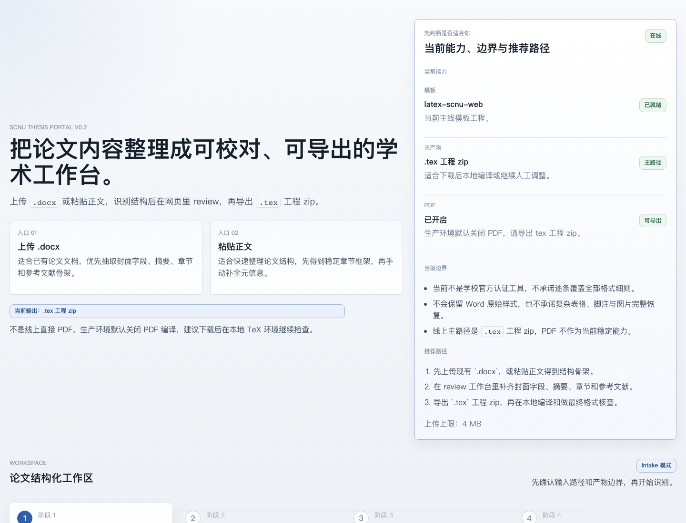
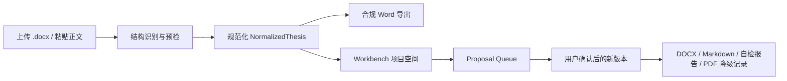
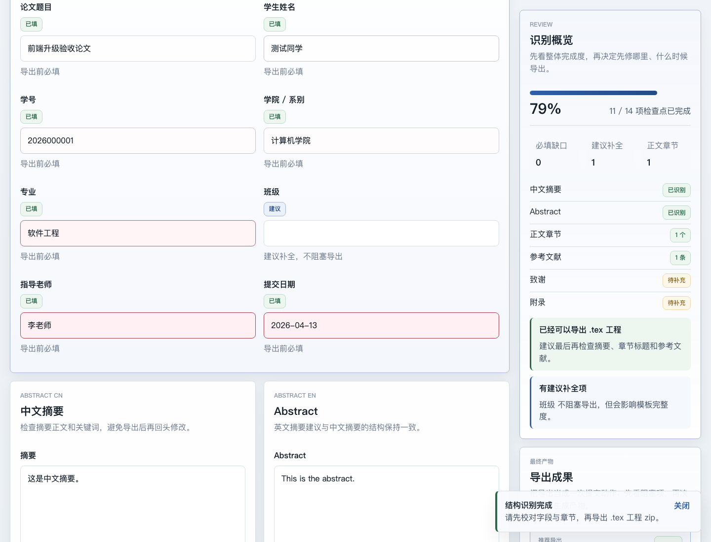

# SCNU Thesis Agent Workbench

面向华南师范大学本科毕业论文的格式合规、审稿意见处理、版本管理与多格式导出工作台。




`scnu-thesis-portal` 不是代写工具，也不是学校官方系统。它的核心价值是把论文 `.docx` 解析、结构规范化、合规检查、版本与导出放入一个可追溯的项目空间。任何 AI 或规则候选内容都必须先进入 Proposal Queue，用户确认后才可能生成新版本。

- **主站路线**: 中国大陆云服务器 + 自定义域名 + ICP 备案
- **Vercel mirror**: [scnu-thesis-portal.vercel.app](https://scnu-thesis-portal.vercel.app) 仅作为静态预览，不承载 Workbench 后端
- **English**: [README-en.md](README-en.md)
- **快速导出**: 上传 `.docx` 或粘贴已有论文正文，预检后导出规范化 Word
- **Workbench Demo**: 公开站提供安全示例项目，不包含真实论文正文，不调用远程 Provider
- **私有部署**: 推荐用于真实论文、Provider key、本地 Ollama 和完整 Workbench
- **公开边界**: 非官方、非代写、不承诺查重率、不伪造参考文献或实验数据

## 当前主线



当前导出固定覆盖：

- 正式封面
- 中文摘要
- 英文摘要
- 目录
- 正文
- 参考文献
- 附录
- 致谢

规则优先级：

`2025 学校规范 PDF > 学生手册 .doc（仅补充未写明项）> templates/upstream/latex-scnu/main.pdf > 旧模板 / README / 旧逻辑`

## 功能

- `.docx` 上传与纯文本输入共用同一套中间结构解析链路
- `NormalizedThesis v2`: 稳定 block id、source spans、provenance、confidence、comments、format risks
- Workbench 项目空间: 项目、文件、版本、导出记录、Issue Ledger、Proposal Queue
- Agent 事件骨架: 解析任务、事件流、规则建议、用户确认 / 拒绝 / 暂存
- 多输入解析 registry: `.docx`、文本、PDF 本地粗解析、图片/OCR 占位、参考文献文件
- 导出 registry: `.docx`、Markdown、自检报告、PDF 降级占位
- Provider 设置: OpenAI、Gemini、DeepSeek、MiniMax、Ollama 元数据、服务端密钥保存、验证状态与 SSRF 防护
- 访问码保护、隐私模式提示、远程 Provider 项目级授权
- `.docx` 合规检查脚本: `scripts/check_docx_compliance.py`

## 产品截图




## Quick Start

```bash
git clone https://github.com/Jia-Ethan/scnu-thesis-portal.git
cd scnu-thesis-portal

uv sync --extra dev
npm install --prefix web
```

启动后端：

```bash
uv run uvicorn backend.app.main:app --reload --port 8000
```

启动前端：

```bash
VITE_API_BASE_URL=http://127.0.0.1:8000 npm run dev --prefix web
```

访问：

- 快速导出: `http://127.0.0.1:5173/`
- Workbench: `http://127.0.0.1:5173/#/workbench`
- Workbench Demo: `http://127.0.0.1:5173/#/workbench-demo`

## Self-host

真实论文建议使用私有部署。复制 `.env.example` 后设置：

- `SCNU_ACCESS_CODE`: 保护 API 和 Workbench
- `SCNU_SECRET_KEY`: 用于服务端封存 Provider API key
- Ollama 本地模型: 优先用于隐私敏感的草稿候选

```bash
docker compose up --build
```

生产主站建议使用国内云服务器与自定义域名；Vercel 只保留静态 public mirror。完整 Workbench、Provider key、远程授权和长期项目数据建议放在私有环境。

生产部署参考：

```bash
cp .env.production.example .env.production
docker compose --env-file .env.production -f docker-compose.production.yml up -d --build
```

运维说明见 [国内主站部署 Runbook](docs/ops-mainland-runbook.md)。

## Privacy

- 公开站默认不启用远程 LLM Provider
- 公开导出文件保留 30 分钟，过期后清理
- 匿名入口需要隐私确认、Turnstile 与 IP 限流
- Provider key 只在服务端封存，前端只显示 metadata、capabilities、configured、verified
- 远程 Provider 必须经过项目级授权，且可撤销
- 参考文献只做格式整理，不补造缺失作者、刊名、卷期或 DOI
- 复杂表格、图片、脚注、浮动对象进入人工复核，不作为无损修复承诺

详细说明见 [Privacy Boundary](docs/privacy.md)。

## Roadmap

- `v0.3.0-public-site`: Landing、README、截图、隐私边界、Workbench demo
- `v0.4.0-agent-runtime`: thesis_jobs、typed streaming、cancel / retry、stale job detection
- `v0.5.0-comment-resolver`: 老师批注解析、定位、修订 Proposal
- `v0.6.0-project-package`: `.scnu-thesis.zip` 导入导出
- `v0.7.0-provider-runtime`: Ollama、OpenAI、Gemini、DeepSeek、MiniMax Provider runtime

完整路线见 [Roadmap](docs/roadmap.md)。

## Architecture

- `backend/app/`: 统一解析、预检、Word 渲染、Workbench API、数据层与导出 registry
- `backend/story2paper/`: 实验性多 Agent 研究代码，不进入默认论文导出主线
- `web/`: 公开首页、快速导出、预检弹窗、Workbench UI 与 demo preview
- `templates/working/sc-th-word/`: 当前工作模板与正式封面资产
- `scripts/check_docx_compliance.py`: 主线 `.docx` 合规检查脚本
- `docs/`: 规范映射、审计、验收、隐私、路线图与 vNext 设计

详细说明见 [Architecture](docs/architecture.md)。

## Verification

```bash
uv run pytest tests -q
npm run test:smoke --prefix web
npm run build --prefix web
uv run python scripts/build_web_public.py
uv run python scripts/export_compliance_fixture.py tmp/fixture-export.docx
uv run python scripts/check_docx_compliance.py tmp/fixture-export.docx
```

## 限制

- 目标是“本科论文送审稿基线”，不是任意 Word 文档无损格式修复器
- 当前不提供研究生模板、多学校入口、云端 SaaS 多租户或多人实时协作
- PDF 导出当前保留 `.docx` 结果并记录转换降级，不承诺 PDF 高保真
- Story2Paper 旧流水线已降级为实验参考，不作为公开主线
- 真实 LLM / Director Runtime / OCR Provider / `.scnu-thesis.zip` 仍在路线图中

## 文档

- [Public Site](docs/public-site.md)
- [Workbench vNext](docs/workbench-vnext.md)
- [Roadmap](docs/roadmap.md)
- [Privacy](docs/privacy.md)
- [Architecture](docs/architecture.md)
- [API](docs/api.md)
- [规范映射表](docs/scnu-undergraduate-format-spec-map.md)
- [已知限制](docs/known-limitations-word-export.md)
- [Changelog](CHANGELOG.md)
- [Contributing](CONTRIBUTING.md)
- [Security](SECURITY.md)

## License

本仓库按项目现有许可证与上游模板许可证边界使用。学校规范、手册与上游模板只作为规则来源与实现参考。
